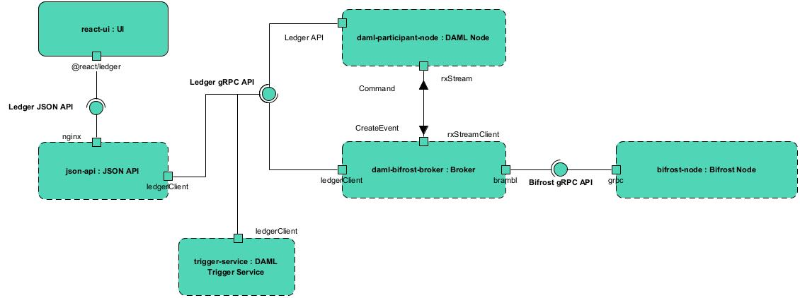

# Architecture

We illustrate the architecture of a DAML application that integrates with the Bifrost node.

## Overview

This is an Internal Block Diagram representing the different components of a DAML application integrated with the Bifrost node through the bifrost-daml-broker. Each block with a solid border represents a component that needs to be provided by the Dapp. The block with a dashed border represents components that are already a part of the ecosystem and that just need to be configured and deployed to make the app work. The small blocks attached to the components are called ports and represent a particular interaction of the component with the outside.

## Description of the Components

### react-ui

The react-ui is the UI of the application. The application provides this UI, which interacts with the JSON API usually through the `@react/ledger` Typescript library.

### json-api

The JSON API is a component provided by DAML. It is basically an executable JAR file that acts as an intermediary between a JSON API and the more complete Ledger gRPC API of the DAML Node. Applications can expose it through an nginx reverse proxy.

### daml-participant-node

The daml-participant-node is the DAML engine that executes and manages the contracts written in DAML.

### trigger-service

The trigger-service is another DAML component that allows to react to modifications in the DAML ledger using DAML code.

### bifrost-node

The bifrost-node is the implementation of the Topl blockchain.

### daml-bifrost-broker

The daml-bifrost-broker is the component that acts as an intermediary between the daml-participant-node and the bifrost-node.
